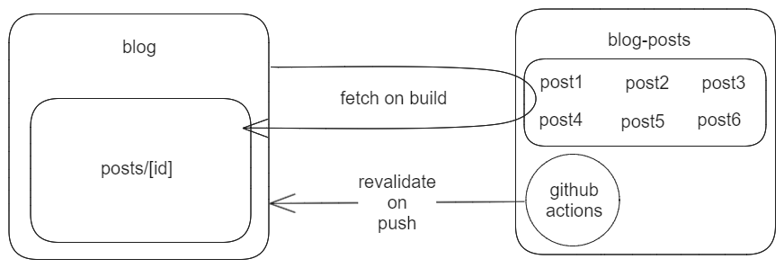

## 배포 주소

https://chun-blog.vercel.app

## 구조 설계



게시글에 변경이 있을 때 블로그가 빌드, 배포 과정을 겪을 필요는 없어서 블로그와 게시글을 별도의 저장소로 분리했다.  
blog-posts에 변경사항을 push 하면 github actions를 활용해 자동으로 blog를 revalidate 해서 최신화(ISR) 하는 구조로 설계했다.

---

## 폴더 구조

### blog

```
📂src
┣ 📂app
┃ ┣ 📂api
┃ ┃ ┗ 📂revalidate
┃ ┃ ┃ ┗ 📜route.ts     <= 블로그 revalidate API
┃ ┣ 📂posts
┃ ┃ ┗ 📂[id]           <= 게시글 dynamic route
┃ ┃ ┃ ┣ 📜not-found.tsx
┃ ┃ ┃ ┗ 📜page.tsx     <= 게시글 페이지
┃ ┣ 📜layout.tsx
┃ ┗ 📜page.tsx         <= 메인 페이지
┣ 📂components
┃ ┣ 📜PostList.tsx     <= 게시글 목록 컴포넌트
┃ ┗ 📜PostListItem.tsx <= 각 게시글 Link 컴포넌트
┗ 📂lib
┃ ┗ 📜post.ts          <= 게시글 관련 fetch 함수
```

### blog-posts

```
📦blog-articles
 ┣ 📂.github
 ┃ ┗ 📂workflows
 ┃   ┗ 📜revalidate.yml <= blog를 revalidate 하는 action
 ┣ 📜dummy-post1.mdx
 ┣ 📜dummy-post2.mdx
 ┣ 📜dummy-post3.mdx
 ┣ 📜dummy-post4.mdx
 ┣ 📜dummy-post5.mdx
 ┣ 📜dummy-post6.mdx
```

---

## 구현 방식

### 게시글 데이터 가져오기

`blog-posts` 저장소에서 `.mdx`로 끝나는 파일들을 가져온 뒤 파일명을 이용해서 각 파일들의 rawMDX를 가져오고 메타데이터와 컨텐츠로 분석해서 반환했다.
참고: [Remote MDX](https://nextjs.org/docs/app/building-your-application/configuring/mdx#remote-mdx),
[next-mdx-remote](https://github.com/hashicorp/next-mdx-remote#access-frontmatter-outside-of-mdx), [Get a tree](https://docs.github.com/ko/rest/git/trees?apiVersion=2022-11-28#get-a-tree)

```ts
import { compileMDX } from 'next-mdx-remote/rsc'

type FileTree = { tree: [{ path: string }] }

export async function getPostByFileName(
  fileName: string
): Promise<BlogPost | undefined> {
  const res = await fetch(
    `https://raw.githubusercontent.com/Chun-gu/blog-posts/main/${fileName}`,
    {
      headers: {
        Accept: 'application/vnd.github+json',
        Authorization: `Bearer ${process.env.GITHUB_TOKEN}`,
        'X-GitHub-Api-Version': '2022-11-28',
      },
    }
  )

  if (!res.ok) return undefined

  const rawMDX = await res.text()

  if (rawMDX === '404: Not Found') return undefined

  const { content, frontmatter } = await compileMDX<{
    title: string
    date: string
    tags: string[]
  }>({
    source: rawMDX,
    options: { parseFrontmatter: true },
  })

  const id = fileName.replace(/\.mdx$/, '')

  const blogPost: BlogPost = {
    meta: {
      id,
      title: frontmatter.title,
      date: frontmatter.date,
      tags: frontmatter.tags,
    },
    content,
  }

  return blogPost
}

export async function getPostMetas(): Promise<Meta[] | undefined> {
  const res = await fetch(
    'https://api.github.com/repos/Chun-gu/blog-posts/git/trees/main?recursive=1',
    {
      headers: {
        Accept: 'application/vnd.github+json',
        Authorization: `Bearer ${process.env.GITHUB_TOKEN}`,
        'X-GitHub-Api-Version': '2022-11-28',
      },
    }
  )

  if (!res.ok) return undefined

  const fileTree: FileTree = await res.json()

  const fileNames = fileTree.tree
    .map((file) => file.path)
    .filter((path) => path.endsWith('.mdx'))

  const posts = []

  for (const fileName of fileNames) {
    const post = await getPostByFileName(fileName)
    if (post) posts.push(post.meta)
  }

  return posts.sort((a, b) => (a.date < b.date ? 1 : -1))
}
```

### 정적 경로

dynamic route segment인 `[id]`와 [generateStaticParams](https://nextjs.org/docs/app/api-reference/functions/generate-static-params)을 사용해 빌드 타임에 모든 게시글에 해당하는 경로를 생성했다.

```ts
export async function generateStaticParams() {
  const postMetas = await getPostMetas()

  if (!postMetas) return []

  return postMetas.map((meta) => ({
    id: meta.id,
  }))
}
```

### 메타데이터

[generateMetadata](https://nextjs.org/docs/app/api-reference/functions/generate-metadata#generatemetadata-function)로 빌드 타임에 메타 정보를 불러와서 해당 게시글의 메타 데이터를 생성했다.

```ts
export async function generateMetadata({ params: { id } }: Props) {
  const post = await getPostByFileName(`${id}.mdx`)

  if (!post) return { title: '존재하지 않는 게시물' }

  return { title: post.meta.title }
}
```

### Not Found

존재하지 않는 게시글에 접근하려 하면 [notFound](https://nextjs.org/docs/app/api-reference/functions/not-found) 함수를 실행해서 not-found 페이지로 이동시켰다.

```tsx
export default async function Page({ params: { id } }: Props) {
  const post = await getPostByFileName(`${id}.mdx`)

  if (!post) notFound()

  const { meta, content } = post

  return (
    <>
      <h2>{meta.title}</h2>
      <p>{meta.date}</p>
      <article>{content}</article>
      <ul>
        {meta.tags.map((tag) => (
          <li key={tag}>{tag}</li>
        ))}
      </ul>
    </>
  )
}
```

## revalidate

blog를 revalidate하는 API 엔드포인트를 생성해서 http 요청을 통해 revalidate 될 수 있도록 했다. 다만 secretKey가 필요하도록 해서 아무나 요청할 수 없도록 했다. 제대로 된 secretKey를 가지고 요청한다면 [revalidatePath](https://nextjs.org/docs/app/api-reference/functions/revalidatePath)로 revalidate 한다.

```ts
src / app / api / revalidate / route.ts

import { NextRequest, NextResponse } from 'next/server'
import { revalidatePath } from 'next/cache'

export async function GET(request: NextRequest) {
  const secretKey = request.nextUrl.searchParams.get('secretKey')

  if (secretKey !== process.env.SECRET_KEY) {
    return new NextResponse(
      JSON.stringify({ message: '유효하지 않은 시크릿 키' }),
      {
        status: 401,
        headers: { 'Content-Type': 'application/json' },
      }
    )
  }

  const path = request.nextUrl.searchParams.get('path') || '/'

  revalidatePath(path)

  return NextResponse.json({ revalidated: true, now: Date.now() })
}
```

### Github Actions

게시글을 업데이트 한 후 blog-posts 레포지토리에 push 하면 github actions가 blog의 api에 요청을 보내서 revalidate 하도록 했다.

```yml
name: revalidate blog

on:
  push:
    branches: ['main']

jobs:
  revalidate:
    runs-on: ubuntu-latest

    steps:
      - name: request revalidate
        uses: JamesIves/fetch-api-data-action@v2
        with:
          endpoint: https://chun-blog.vercel.app/api/revalidate?path=/&secretKey=${{secrets.SECRET_KEY}}
```
